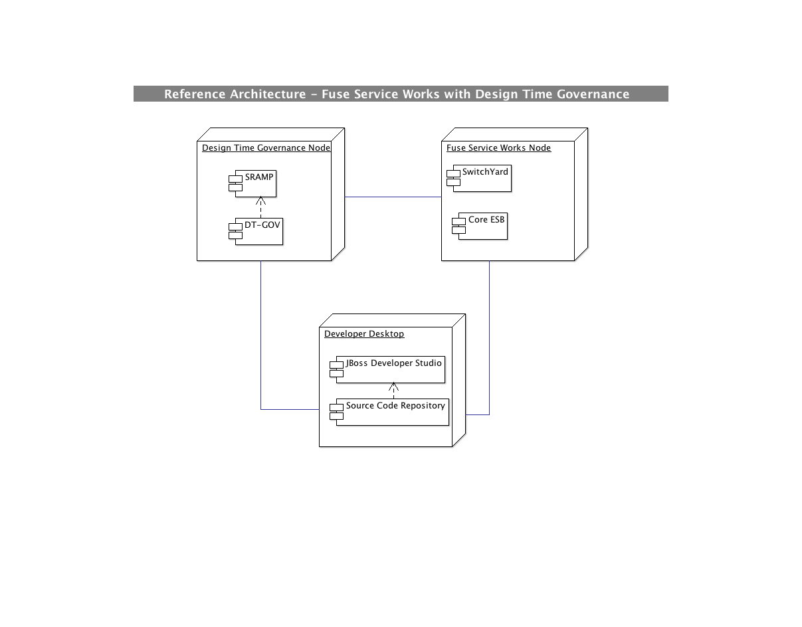

:data-uri:
:toc2:

:rpms: link:https://github.com/jboss-gpe-ose/jboss_bpm_soa_rpmbuild[RPMs]
:fswcart: link:https://github.com/jboss-gpe-ose/openshift-origin-cartridge-fsw-full[Red Hat GPE's FSW cartridge]
:fswproduct: link:https://access.redhat.com/site/documentation/en-US/Red_Hat_JBoss_Fuse_Service_Works/[Red Hat's FSW product]
:osetools: link:https://access.redhat.com/site/documentation/en-US/OpenShift_Enterprise/2/html/Client_Tools_Installation_Guide/index.html[Openshift Enterprise Client Tools]
:remotejavaapi: link:https://access.redhat.com/site/documentation/en-US/Red_Hat_JBoss_BPM_Suite/6.0/html-single/Development_Guide/index.html#sect-Remote_Java_API[Remote Java API Client]
:executionserver: link:https://access.redhat.com/site/documentation/en-US/Red_Hat_JBoss_BPM_Suite/6.0/html-single/Development_Guide/index.html#chap-REST_API[Exection Server]

:rhtlink: link:https://www.redhat.com[Red Hat]

image::images/rhheader.png[width=900]

:numbered!:
[abstract]
== JBoss GPE Reference Architecture:  Fuse Service Works Design Time Governance

:numbered:

== Abstract

== Overview

=== Deployment Architecture

This reference architecture consists of various components:

==== OpenShift Enterprise 2.* FSW S-RAMP/DT-GOV

This node consists of the FSW Design Time Governance components S-RAMP and DT-GOV. 

==== OpenShift Enterprise 2.* FSW App

This node consists of the complete FSW installation excluding the Design Time Governance components. 

==== Local Environment
Your local environment will consist of the following :

. *JBoss Developer Studio* : Eclipse based IDE containing the _Integration Stack_ suite of plugins.

. A repository for source code of FSW projects.

=== Project Structure

The project consists of the following modules:

:numbered:

. *artifacts* - This module consists of the schemas, contracts and policies that are to be governed in the application. These artifacts are packaged in a single jar file are managed in the S-RAMP repository. This module becomes the central artifact repository to be referenced by all other SOA projects in the application. 

. *switchyard_project* - This project consists of a switchyard application depending the artifacts being governed under S-RAMP. The dependencies are resolved using a *maven-wagon* plugin to the S-RAMP repository. 

. *dt_gov_workflow* - This project consists of the jBPM process and associated code in order to run life cycle management of the switchyard project.

== Pre-Requisites

The remainder of this documentation provides instructions for installation, configuration and execution of this reference architecture.
The following is a list of pre-requisites:

. {osetools}
. Openshift Enterprise 2.* environment that has been installed with {rpms} needed to support Red Hat GPE's FSW cartridges.
Red Hat GPE's _Partner Demo System_ is one such environment.
Contact the Red Hat GPE team for more details.
. Two medium-sized Openshift Enterprise gear provisioned with {fswcart} and mysql-5.
. ssh client
. maven 3.0.5 (or greater)
. git client
. familiarity with {fswproduct}
. proficiency with the _bash_ shell 

As is evidenced by these pre-requisites, the assumed BPM Suite 6 run-time environment for this reference architecture is an Openshift Enterprise gear.
However, BPM Suite 6 and Fuse Service Works can be installed in non-PaaS local environments.
Thus, with some adjustments, it could be possible to execute this reference architecture in a non-PaaS local environment as well.

== To-Do

=======
